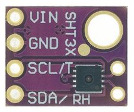
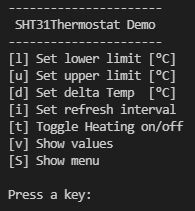

# SHT31Thermostat

The SHT31Thermostat program also implements a thermostat like the 
BME280Thermostat program, but now with the SHT31 sensor. This sensor 
measures temperature and relative humidity and is also queried via an I2C interface.

## Parts



## Wiring
```
   SHT31              Arduino UNO
.--------.          .-------------
|    Vcc o --->     o 5V
|    GND o --->     o GND
|    SCL o --->     o A5
|    SAA o --->     o A4
`--------´          `-------------
```
## User Interface (CLI)

